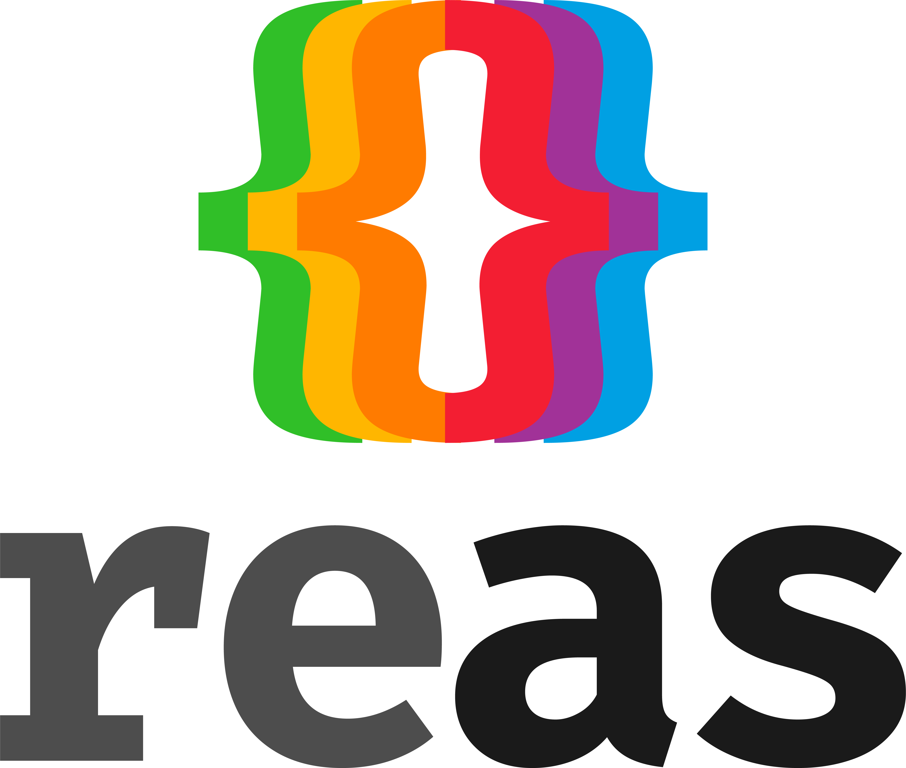

<p align="center">
  <br /><br /><br /><br /><br /><br /><br /><br />
  

  <br /><br /><br /><br /><br /><br /><br />
</p>

# reas

<a href="https://github.com/diegohaz/nod"></a>
<a href="https://npmjs.org/package/reas"></a>
<a href="https://travis-ci.org/diegohaz/reas"></a>
<a href="https://codecov.io/gh/diegohaz/reas/branch/master"></a>

A minimalist and highly composable UI toolkit built on top of [React](https://reactjs.org) and [styled-components](https://www.styled-components.com).

- [**Documentation**](https://diegohaz.github.io/reas/)
- [**Components**](https://diegohaz.github.io/reas/#components)

## Install

Yarn:
```sh
yarn add reas
```

npm:
```sh
npm install --save reas
```

## Examples

### Simple Popover

<p align="center">
  <br />
  See and edit full source code on <a href="https://codesandbox.io/s/m4n32vjkoj">CodeSandbox</a>
</p>

```jsx
import React from "react";
import { render } from "react-dom";
import { InlineBlock, Button, Popover } from "reas";

const App = () => (
  <Popover.State>
    {popover => (
      <InlineBlock relative>
        <Button as={Popover.Toggle} {...popover}>Toggle</Button>
        <Popover {...popover}>
          <Popover.Arrow />
          Popover
        </Popover>
      </InlineBlock>
    )}
  </Popover.State>
);

render(<App />, document.getElementById("root"));
```


## License

MIT © [Diego Haz](https://github.com/diegohaz)
